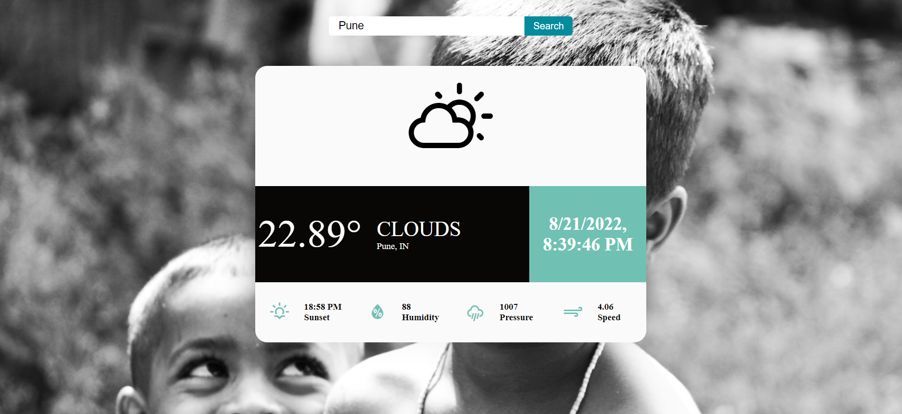

Live Site:

--> WebApp which displays the live weather status of the searched city.
--> Implemented using Reactjs.

API used: 
1. Getting all the details : https://api.openweathermap.org/data/2.5/weather?q=${cityValue}&units=metric&appid=8609b4c6b248fadbf40592006d074809`

Live website link : https://likesh-123.github.io/WeatherApp-UsingReact/

